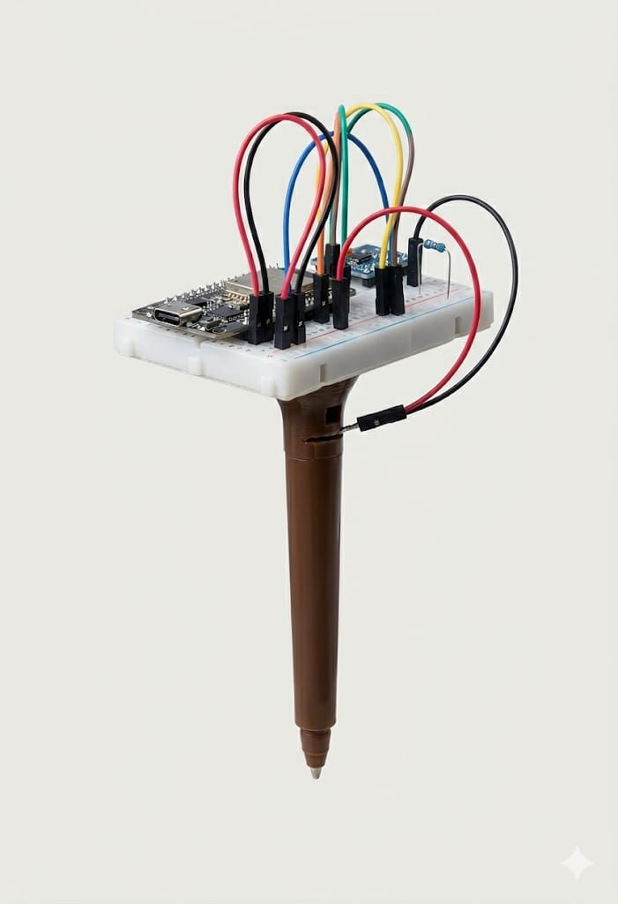
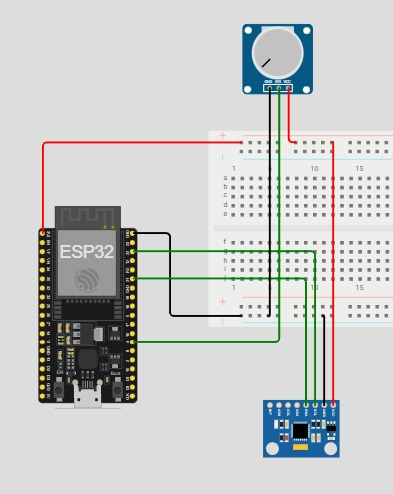

# Stylo: Digitalizando la escritura analógica con TinyML

**Stylo** es un proyecto experimental de hardware y Machine Learning diseñado para traducir los movimientos físicos de la escritura a mano alzada en texto digital. 

A diferencia de los enfoques tradicionales basados en pantallas táctiles o sensores externos, Stylo se basa puramente en la captura de la biometría del trazo. Mediante el uso de sensores inerciales (giroscopio) y de presión integrados en un bolígrafo físico, el sistema captura los patrones cinemáticos de la escritura y utiliza redes neuronales para predecir y clasificar los caracteres trazados. Un acercamiento práctico al mundo del *TinyML* combinando electrónica casera e Inteligencia Artificial.

Stylo se diferencia del resto de sistemas de reconocimiento de escritura que ya existen, en que todo lo necesario está dentro del boli. No se necesitan sensores externos o libretas específicas para que el reconocimiento de la escritura funcione.

## Sobre el Proyecto

El objetivo final de **Stylo** es permitir al usuario escribir en cualquier lugar y que el bolígrafo se encargue de interpretar la escritura para guardar el texto en la nube.

Para lograr esto, el sistema se basa puramente en **datos espaciales (rotación y aceleración) y de presión**. El reto principal radica en interpretar estas series temporales de datos en bruto para encontrar los patrones únicos que definen la biometría de cada letra escrita por el usuario.

**El flujo de trabajo conceptual del sistema es el siguiente:**
1. **Contacto y Captura:** El sensor de presión detecta el momento exacto en el que el bolígrafo toca la superficie (inicio y fin del trazo y fuerza), mientras que el giroscopio registra la cinemática del movimiento en el espacio.
2. **Adquisición:** El microcontrolador recoge y empaqueta estos datos brutos.
3. **Inferencia (ML):** Una red neuronal procesa la secuencia temporal de movimientos y calcula la probabilidad estadística de qué carácter o forma se acaba de trazar.
4. **Traducción:** Las predicciones exitosas se concatenan para digitalizar el texto.

Más allá del resultado final, Stylo tiene un fuerte propósito **educativo y experimental**. Es un campo de pruebas personal para explorar hasta dónde se puede llegar combinando hardware asequible con Inteligencia Artificial, y cómo el Machine Learning puede superar problemas clásicos de los sensores inerciales (como el ruido y el *drift* o deriva) para extraer información útil de datos caóticos.

## Estado Actual (MVP)
Actualmente, el proyecto se encuentra en una fase de Producto Mínimo Viable (MVP) plenamente funcional, habiendo superado los primeros grandes hitos tanto en la integración de hardware como en la validación del modelo de Machine Learning con datos de círculos y triángulos.

### 1. Hardware: Prototipo Físico Ensamblado
Se ha logrado construir y calibrar la primera versión física del bolígrafo inteligente. Los componentes están integrados de tal forma que permiten una escritura cómoda y la realización de pruebas en un entorno real:
* **Sensor de Presión:** Estratégicamente colocado en la punta del bolígrafo. No solo actúa como el "gatillo" del sistema detectando el contacto con el papel, también funciona como un sensor más aportando la fuerza con la que se está presionando en cada momento. Este sensor es crucial para limpiar el ruido y aislar únicamente los datos del giroscopio durante la escritura.
* **Giroscopio y Microcontrolador (MPU 6050 y ESP32):** Montados de forma compacta para capturar la cinemática en tiempo real sin entorpecer el movimiento natural de la mano.

### 2. Software: Primer Modelo de Deep Learning (Keras)
Para validar que los datos en bruto extraídos del giroscopio y el sensor de presión contienen la información necesaria para predecir trazos, se ha desarrollado una primera red neuronal utilizando **Keras/TensorFlow**.

* **Clasificación de Formas Básicas:** Actualmente, el modelo es capaz de aislar trazos independientes y distinguir con éxito entre **círculos y triángulos**.
* **Métricas de Precisión:** El modelo alcanza una precisión de **aprox. 90-95%** en el testeo en vivo.
* **Robustez y Generalización:** El entrenamiento no se ha limitado a un único patrón rígido. Se han introducido amplios grados de libertad en el dataset, grabando figuras dibujadas a **múltiples tamaños, velocidades y direcciones**. Esto demuestra que la red neuronal está aprendiendo la "esencia" cinemática de la figura, siendo tolerante a las variaciones naturales del pulso humano.

*(🎥 Nota para ti: Si tienes un pequeño video o GIF de la terminal mostrando la predicción correcta al dibujar un círculo o triángulo, ¡ponlo aquí! ``)*
